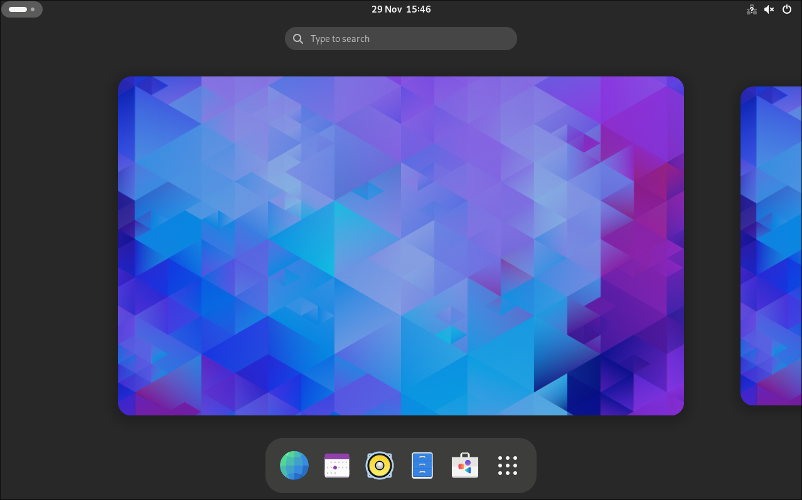

+++
title = 'The GNOME Desktop Environment - Getting Started'
date = 2023-11-29T15:29:47+01:00
draft = false
author = 'Janis Hutz'
tags = [ 'Linux' ]
categories = [ 'Guides' ]
series = [ 'arch-dev-vm' ]
series_weight = 2
featuredImage = "gnome45.webp"
+++

**Attribution for featured image:**

[Official Launch Image](https://foundation.gnome.org/2023/09/20/introducing-gnome-45/) from the [GNOME foundation](https://foundation.gnome.org)

<!-- TODO: Add featuredImage to all arch-dev-vm posts -->

# The GNOME Desktop Environment - Getting Started

There is barely any other user interface that achieves the sleekness and user-friendliness that GNOME achieves, on no operating system. It has its own workflow and once adjusting to it, you don't want to switch to a user interface that uses a similar concept to the ones found on Windows or macOS. It has inspired quite a few other desktop environments to use or support the same kind of workflow.

# The Activities Screen

When you launch GNOME, you are dropped into what is called the activities overview screen. This is where you can see all your open windows and workspaces. Also, the very powerful search of GNOME can be found there. When using GNOME, get used to searching for programs, as this is much faster than reaching for your mouse to click onto programs, as per default, GNOME doesn't support having icons on your desktop. From the desktop, you can reach the overview by pressing the Windows-Key on your PC. If you press the Windows-Key twice, you will reach the application drawer which you can also reach by clicking onto the nine dots icon in the *dash*, the taskbar of GNOME.

# File Management
GNOME's default file manager, nautilus is good for any day-to-day task, but in case you need more complex features, it can get quite limited, due to the fact that all GNOME apps are focusing on user-friendliness instead of offering all the features you could possibly want, which in turn leads to the apps being more difficult to understand. In GNOME, when you search for "Files", you will find the file manager. If you search, you might also notice that the search also finds Characters, settings, additional software and sometimes more.

# Installing more software
Installing Software on Linux is much different from how it's done on Windows. On Linux, there are so-called software repositories that contain the software that we need on our systems. They are packaged by the distribution's maintainers. There are two ways in which you can install software, if it's a graphical application and a single one if it's a CLI (Command Line Interface) application or backend component

## Package Manager
The Package Manager for me is the only way I install software, as I don't like to have a graphical software store. This piece of software is operated in the terminal and the command to be run depends on the Linux-Distribution used. In the case of Arch Linux, the package manager is called `pacman`. Whilst it is really great, I highly recommend you use an AUR helper like yay.


You install it by running the following commands in Terminator (press the Windows key and type Terminator):

```
cd /tmp
git clone https://aur.archlinux.org/yay.git
cd yay
makepkg -si
```


Syntactically speaking, their usage is basically the same. You can also update your whole system by just running one single command, which is what I recommend doing before installing new Software to avoid version mismatches.

### Installing new Software
You can install a new package by running either one of the two commands below:
```
sudo pacman -S [package name here]
yay -S [package name here]
```


If you wanted to install Firefox, you'd run either one of the two commands:
```
sudo pacman -S firefox
yay -S firefox
```



To be able to install with YAY, you need to have it installed.

Additionally, it is always important to always check what you are installing / removing before confirming the operation, regardless of whether you use yay or not (see [the LTT example of what can happen](https://youtu.be/0506yDSgU7M?feature=shared&t=634))


### Updating
You can update your whole system by running either one of the two commands below:
```
sudo pacman -Syu
yay -Syu
```

This will update EVERY package installed on your system, and you will never have to worry about having outdated software ever again.

### Removing software
You can install a new package by running either one of the two commands below:
```
sudo pacman -R [package name here]
yay -R [package name here]
```


If you wanted to uninstall Firefox, you'd run either one of the two commands:
```
sudo pacman -R firefox
yay -R firefox
```

If you want to remove all the package's dependencies that are no longer required for the system run:
```
sudo pacman -Rs firefox
yay -Rs firefox
```




To be able to remove packages with YAY, you need to have it installed.

Additionally, it is always important to always check what you are installing / removing before confirming the operation, regardless of whether you use yay or not (see [the LTT example of what can happen](https://youtu.be/0506yDSgU7M?feature=shared&t=634))


## GNOME Software
GNOME Software is GNOME's frontend to the package manager that you run in the CLI. You can use it to search for any software you want to install. 

# GNOME Web
This is the default GNOME Web browser, formerly know as Epiphany. It is based on WebKitGTK, so it uses the same base rendering engine as Safari. This can be useful when developing websites, as you can have a browser with every single rendering engine that is in use today on the same OS.

# Settings
This is the GNOME settings app, where you can adjust all the important settings of the Desktop Environment, like heading into dark mode, changing the keyboard layout, changing to natural scrolling (the in my *objective* opinion better scrolling direction... well I prefer it, give it a try, if you wish) or whatever else there is that needs to be adjusted. For changing to dark mode, as there is a transition period from an older version of a toolkit to a newer one, you also need to set dark mode in GNOME tweaks.

# GNOME Tweaks
In GNOME Tweaks, you can adjust more advanced GNOME settings. What you are probably most interested in is the appearance tab, where you can change the Legacy Applications Style to HighContrastInverse for dark mode. 

In the Windows tabs, you can add back the maximize and minimize buttons as well.


# Status Bar
You might have noticed the bar that goes along the top with the time and date in the centre. This is the so-called status bar. In the top left, you can find the workspaces indicator, which shows you, how many workspaces there are and which one you're currently on. If you click onto that indicator, the activities screen opens. 

When clicking onto the time and date in the centre of the bar, the notification centre and calendar are revealed. 

Finally, towards the right, there's the Quick-Actions menu which allows you to for example take a screenshot, lock your device and shut it down, as well as editing the connection, and you can change between light and dark mode.


# Closing thoughts
As you can see, GNOME is very user-friendly and uses a different kind of workflow. 


You can speed up your workflow by using keyboard shortcuts. Here are the most important ones: 
- Super + Left / right arrow: Tile Window to right or left
- Super + Arrow up: Maximize window
- Super + Arrow down: Minimize window
- Alt + Tab: Cycle through windows
- Super + A: Open applications drawer (equivalent) to double-pressing the super key
- Super + Page up / Page down: Move up / down one workspace
- Super + Shift + Page up / Page down: Move current window up / down one workspace

You can view all shortcuts in the Keyboard > Keyboard Shortcuts menu in the settings app.


In the next part of this series of guides, you're going to learn how to use the terminal.