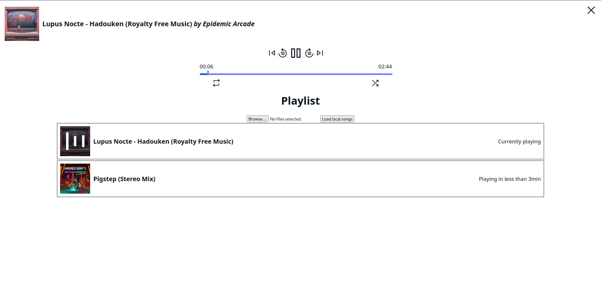

+++
title = 'Project Updates June 2024'
date = 2024-06-26T18:02:25+02:00
lastmod = 2024-06-26T18:02:25+02:00
draft = true
author = 'Janis Hutz'
tags = [ 'Development' ]
categories = [ 'News' ]
series = [ 'project-updates' ]
series_weight = 5
featuredImage = "/posts/2024/04/upcoming-projects/new-projects.jpg"
+++

Welcome back for your monthly dose of project updates! Today, I have quite a few updates for you

# ConductorCalc
Let's get started talking about ConductorCalc. This project's been in the works for quite some time now, but hasn't had my main focus of attention. Nothing has changed on that, but I have finally got a UI mock-up to share with you.

I have also started implementing some of the algorithms that it will be using, including unit tests. Currently, it looks like the project is on track for the planned release date of September 15th 2024. But problems can always arise during development, which could throw me back days, weeks or, if worse comes to worst, months.

## Features
I haven't shared much about the features that ConductorCalc will have, so here are some of the highlights:
- Cloud Sync (optional, subscription-based)
- Cross-Platform (Linux, iOS, iPadOS, MacOS, Windows, Android and Web)
- All the calculation options that you need
- Projects to group together calculations
- Light and Dark themes
- ...

These are the features I am going to tease so far. I will share more details over the coming months.

# MusicPlayer
I am currently working on a massive redesign of the MusicPlayer. It will, once it is completed, get its own website and will be available to download and self-host, or subscription-based if you don't want to set it up yourself and want to use the hosted version.

So far, most essential features are implemented. Most notably, the remote showcase screen is a feature that is still missing.

## Features
- Mix Apple Music and local songs into one playlist
- Export and Import previous playlists
- Reorder songs
- All the features you'd expect from a normal music player
- Access your Apple Music Playlists
- For your local songs, the Apple Music API will be used to fetch cover images and other missing metadata as good as possible
- Remote showcase screen, which can be reached by any user over a URL that is displayed to you in the UI
- ...

There are more features, but I couldn't be bothered to write them all down just now. A more complete list will be available, once it is complete

## Roadmap
I have spent the last three days working on this project exclusively and the progress has been really solid. I don't expect it to launch for another two months or so, as I will have less time to work on projects due to work. 

# impress.js
And here we are again, talking about impress.js, even though there has not been any work on the code at all over the last three months. I am planning to get to work on it again in late August, as that is probably the time when I have some to spare.

# Store
Last, but not least, the software store is going to soon start selling summaries for maths topics. You will not be able to download the PDFs, but have to be logged into the store whenever you want to view them.

# Closing notes
I have not been working on development as much as I'd have liked over the last few weeks, as I just finished my current school and I needed some time off to relax, as the exam phase was quite exhausting. And I will be working for the next six weeks, so less time there as well... and then in September, my studies will commence...